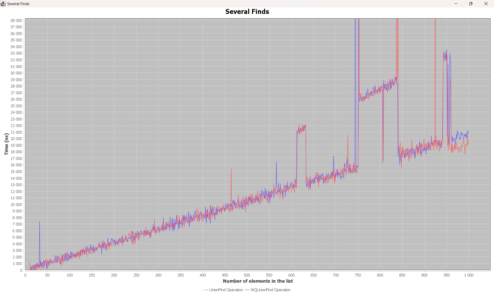

# Programmeringsuppgift 1
 Run main!

## 1
[Click here!](./src/timer/Timer.java)

## 2
[Click here!](./src/unionfind/UnionFind.java)

## 3
[Click here!](./src/wqunionfind/WQUnionFind.java)

## 4

### Union
1. The union operation in the first version of UnionFind (quick find) shows more or less linear growth. 
This is because it usually takes about the same time to perform each loop in the union method. 
For example, it took 3000 ns to perform a union in a list with 10,000 elements and 30,000 ns for a list with 100,000 elements. 
The growth is: y=0.3x. We can see this in the graph, along with some deviations.

2. In the Waited Quick UnionFind, we do not observe any growth because there are no loops that depend on the number of elements in the list, 
several if statements are present.

### Several unions
1. When performing several union operations in the first version of UnionFind (quick find), the growth is again linear. 
This is because it takes approximately the same time to perform each union operation, 
which is why it takes twice as long to perform 2 unions compared to 1. 
This is evident in the graph, where we also see significant deviations. The growth rate is y=35x.

2. As shown in the graph, when performing several union operations in the Waited Quick UnionFind, the growth is again linear but much slower. 
The growth rate is approximately y=20x, which is nearly double as fast compared to the first version of UnionFind. 

### Find
The find operation is significantly faster than union because it involves no loops, 
just one if statement, and thus does not exhibit growth depending on the list size.

### Several finds
Performing multiple find operations shows linear growth, and the performance is approximately equal for both algorithms, 
as both have just one if statement. The growth rate is y=20x.

## 5
[Click here!](./src/threesum/ThreeSum.java)

## 6
[Click here!](./src/threesum/ThreeSumCaching.java)

## 7

The growth in this improved 3-sum function is quadratic, which is much better than what we had before — cubic.

### Computing the slope between 100 and 300: 
xy100 = (100, 171 000)
xy300 = (300, 1 775 000)
ty = 300 - 100 
tx = 1 775 000 - 171 000 
m = 1 604 000 / 200  
m = 8020  

### Computing the slope between 300 and 500:
xy300 = (300, 1 775 000)
xy500 = (500, 6 430 000)
ty = 500 - 300  
tx = 6 430 000 - 1 775 000  
m = 4 655 000 / 200
m = 23 275  

### Computing the growth
xy300 = (300, 1 775 000)
xy500 = (500, 6 430 000)
b = (log2(6 430 000) - log2(1 775 000) / log2(500) - log2(300))
b = (22.616 - 20.76) / (8.966 - 8.229)
b = 1,856 / 0,737
b ≈ 2,52

c=log2time(x)−b⋅log2(x)
c = 20,76 - 2,52 * 8,229
c = 20,76 - 20,73708
c = 0,023

### Growth power low
a⋅x^b
a=2^c
a=1.016070143

### Growth:
1.016070143 * x^2.52

According to this formula, the time to execute three sum for a list with 1000 elements is supposed to be 36,891,276.62 ns. 
The actual execution time for three sum on 1000 elements was 40 000 000 ns, 
which is off by ≈ 3 000 000 ns. I consider this close enough.