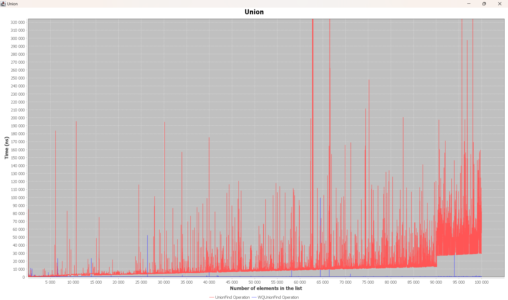
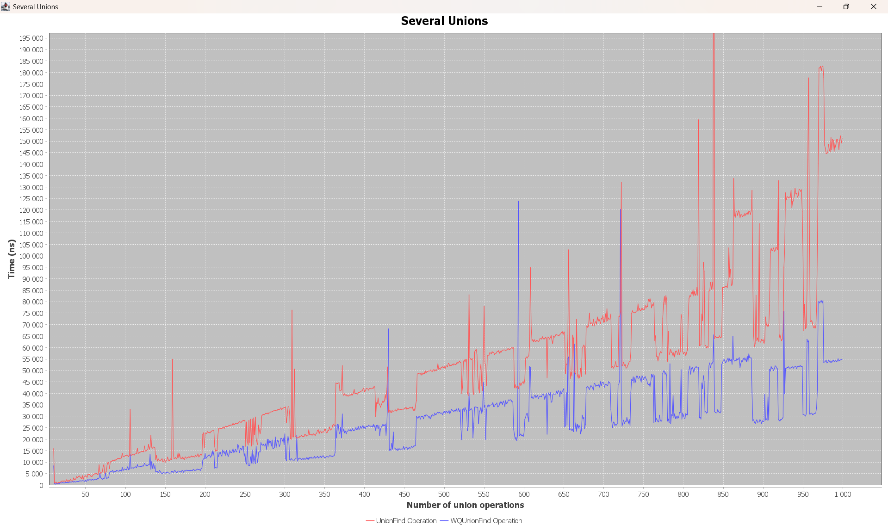
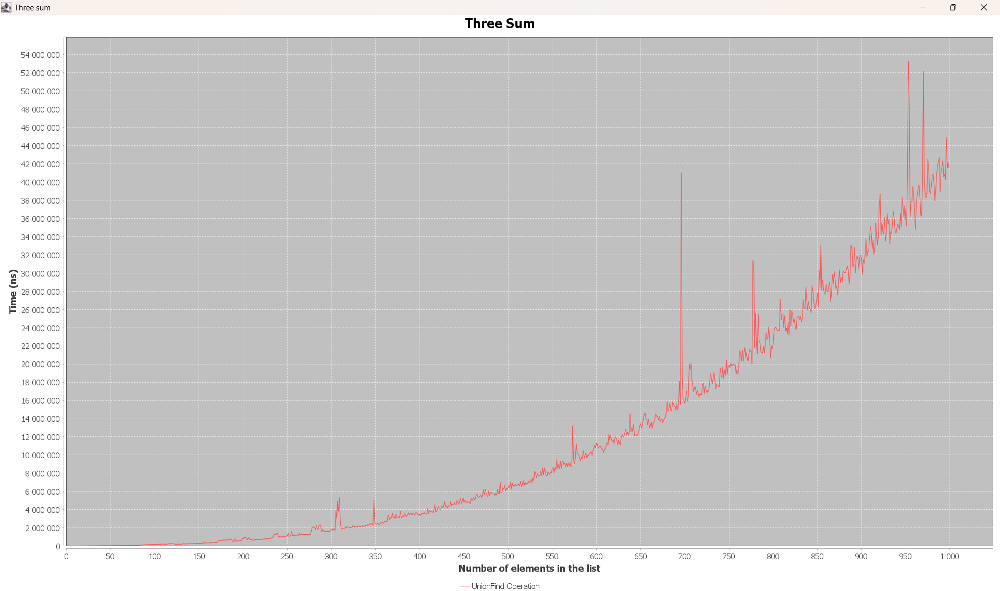

# Algorithmer - Disjoint And 3Sum 
 **Java**: For implementing the algorithms.
 **JFreeChart**: For visualizing algorithm performance through graphs.
 

Run the `Main` class to demonstrate the algorithms.
This project demonstrates the performance of various algorithms, including Union-Find, Weighted Quick Union-Find, and the Three Sum problem. The goal is to visualize the time complexity of each algorithm by running them on lists of varying sizes and plotting the results using `JFreeChart`.

The project contains multiple classes that implement different versions of the algorithms, measure their execution time, and display the results in graphical form. The charts provide an insightful comparison of how different approaches handle increasing input sizes.

## 1. Timer Class
[Click here to view the Timer implementation](./src/timer/Timer.java)

## 2. Union-Find Algorithm
[Click here to view the Union-Find implementation](./src/unionfind/UnionFind.java)

## 3. Weighted Quick Union-Find
[Click here to view the Weighted Quick Union-Find implementation](./src/wqunionfind/WQUnionFind.java)

## 4. Union Operation

### Union
1. The union operation in the first version of UnionFind (quick find) shows more or less linear growth. This is because it takes approximately the same amount of time to perform each loop in the union method. For example, it took 3000 ns to perform a union on a list with 10,000 elements and 30,000 ns for a list with 100,000 elements. The growth is y = 0.3x, which can be observed in the graph, along with some deviations.
2. In the Weighted Quick Union-Find algorithm, we don't observe any growth since the algorithm doesn't contain loops that depend on the number of elements in the list. It simply uses several `if` statements.

### Multiple Unions
1. Performing multiple union operations in the first version of UnionFind (quick find) results in linear growth. This is because the time it takes to perform each union is roughly the same, so it takes twice as long to perform 2 unions compared to 1. The graph also shows some deviations. The growth is approximately y = 35x.
2. In the Weighted Quick Union-Find, the growth is again linear but much slower. The growth rate is approximately y = 20x, which is nearly half the speed of the first version of UnionFind.

### Find Operation
The find operation is significantly faster than union because it doesn't involve loops—only a single `if` statement. Therefore, the operation does not show any growth related to the size of the list.

### Multiple Finds
Performing multiple find operations results in linear growth, and the time complexity is similar for both algorithms since both involve only a single `if` statement. The growth rate is y = 20x.

## 5. Three Sum Algorithm
[Click here to view the Three Sum implementation](./src/threesum/ThreeSum.java)

## 6. Cached Three Sum Algorithm
[Click here to view the Cached Three Sum implementation](./src/threesum/ThreeSumCaching.java)

## 7. Three Sum Operation

The growth in this improved 3-sum function is quadratic, which is much better than the cubic growth observed in the original algorithm.

### Computing the Slope and Growth

- **Slope between 100 and 300:**
    - xy100 = (100, 171 000)
    - xy300 = (300, 1 775 000)
    - Difference: ty = 300 - 100, tx = 1 775 000 - 171 000
    - Slope m = 1 604 000 / 200 = 8020

- **Slope between 300 and 500:**
    - xy300 = (300, 1 775 000)
    - xy500 = (500, 6 430 000)
    - Difference: ty = 500 - 300, tx = 6 430 000 - 1 775 000
    - Slope m = 4 655 000 / 200 = 23 275

- **Growth Calculation:**
    - xy300 = (300, 1 775 000)
    - xy500 = (500, 6 430 000)
    - b = (log2(6 430 000) - log2(1 775 000)) / (log2(500) - log2(300))
    - b ≈ 2.52
    - c = log2(1 775 000) - b * log2(300)
    - c ≈ 0.023

- **Growth Formula:**
    - a * x^b
    - a ≈ 1.016
    - Final growth: 1.016 * x^2.52

According to this formula, the time to execute the 3-sum function for a list with 1000 elements should be approximately 36,891,276.62 ns. The actual execution time was around 40,000,000 ns, which is off by ≈ 3,000,000 ns—close enough.

---

## How to Run
- To run the project, simply execute the `Main` class. It will test the different algorithms and generate the charts mentioned above.